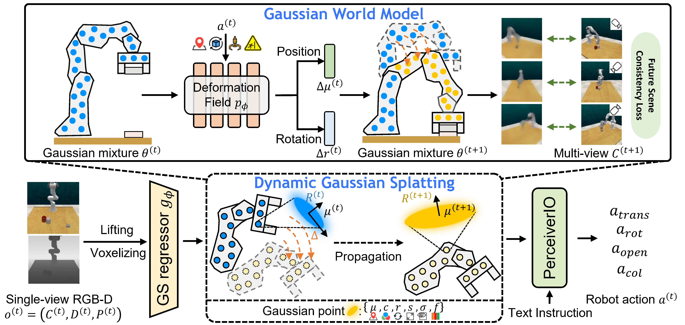

# ManiGaussian

🦾 [**ManiGaussian: Dynamic Gaussian Splatting for Multi-task Robotic Manipulation**](https://arxiv.org/abs/2403.08321)  
[Guanxing Lu](https://guanxinglu.github.io/), [Shiyi Zhang](https://shiyi-zh0408.github.io/), [Ziwei Wang](https://ziweiwangthu.github.io/), [Changliu Liu](https://www.cs.cmu.edu/~cliu6/), [Jiwen Lu](http://ivg.au.tsinghua.edu.cn/Jiwen_Lu/), [Yansong Tang](https://andytang15.github.io/)

**[[Project Page](https://guanxinglu.github.io/ManiGaussian/)] | [[Paper](https://arxiv.org/pdf/2403.08321.pdf)]**

ManiGaussian is an end-to-end behavior cloning agent that learns to perform various language-conditioned robotic manipulation tasks, which consists of a dynamic Gaussian Splatting framework and a Gaussian world model to model scene-level spatiotemporal dynamics. The dynamic Gaussian Splatting framework models the propagation of semantic features in the Gaussian embedding space for manipulation, and the Gaussian world model parameterizes distributions to provide supervision by reconstructing the future scene.



# 📝 TODO
- [X] Release pretrained checkpoints.
- [ ] Provide a Dockerfile for installation.

# 💻 Installation

**NOTE**: ManiGaussian is mainly built upon the [GNFactor](https://github.com/YanjieZe/GNFactor) repo by Ze et al.

See [INSTALL.md](docs/INSTALL.md) for installation instructions. 

See [ERROR_CATCH.md](docs/ERROR_CATCH.md) for error catching.

# 🛠️ Usage

The following steps are structured in order.

## 🦉 Generate Demonstrations

To generate demonstrations for all 10 tasks we use in our paper, run:
```bash
bash scripts/gen_demonstrations_all.sh
```

## 📈 Training
We use wandb to log some curves and visualizations. Login to wandb before running the scripts.
```bash
wandb login
```
To train our ManiGaussian without semantic features and deformation predictor (the fastest version), run:
```bash
bash scripts/train_and_eval_w_geo.sh ManiGaussian_BC 0,1 12345 ${exp_name}
```
where the `exp_name` can be specified as you like. You can also train other baselines such as `GNFACTOR_BC` and `PERACT_BC`.

To train our ManiGaussian without semantic features, run:
```bash
bash scripts/train_and_eval_w_geo_dyna.sh ManiGaussian_BC 0,1 12345 ${exp_name}
```

To train our ManiGaussian without deformation predictor, run:
```bash
bash scripts/train_and_eval_w_geo_sem.sh ManiGaussian_BC 0,1 12345 ${exp_name}
```

To train our vanilla ManiGaussian, run:
```bash
bash scripts/train_and_eval_w_geo_sem_dyna.sh ManiGaussian_BC 0,1 12345 ${exp_name}
```

> - We train our ManiGaussian on two NVIDIA RTX 4090 GPUs for <2 days.
> - If there is an unexpected crash, enter 'q' to exit the python debugger (pdb) smoothly.

## 🧪 Evaluation
To evaluate the checkpoint, you can use:
```bash
bash scripts/eval.sh ManiGaussian_BC ${exp_name} 0
```
**NOTE**: The performances on `push_buttons` and `stack_blocks` may fluctuate slightly due to different variations.

## 📊 Analyze Evaluation Results
After evaluation, the following command is used to compute the average success rates. For example, to compute the average success rate of [our provided csv files](ManiGaussian_results/), run:
```bash
python scripts/compute_results.py --file_paths ManiGaussian_results/w_geo/0.csv ManiGaussian_results/w_geo/1.csv ManiGaussian_results/w_geo/2.csv --method last
```

# 🌴 Checkpoint

[Checkpoint](https://cloud.tsinghua.edu.cn/d/b09de0a8d23f41b9b4ee/).
After downloading it to your `logs/` folder, you can run the following command to check the result:
```bash
python scripts/compute_results.py --file_paths logs/gs_rgb_emb_001_dyna_01_0305/seed0/eval_data.csv --method last
``` 

# 🏷️ License
This repository is released under the MIT license.

# 🙏 Acknowledgement

Our code is built upon [GNFactor](https://github.com/YanjieZe/GNFactor), [LangSplat](https://github.com/minghanqin/LangSplat), [GPS-Gaussian](https://github.com/aipixel/GPS-Gaussian), [splatter-image](https://github.com/szymanowiczs/splatter-image), [PerAct](https://github.com/peract/peract), [RLBench](https://github.com/stepjam/RLBench), [pixelNeRF](https://github.com/sxyu/pixel-nerf), [ODISE](https://github.com/NVlabs/ODISE), and [CLIP](https://github.com/openai/CLIP). We thank all these authors for their nicely open sourced code and their great contributions to the community.

# 🥰 Citation
If you find this repository helpful, please consider citing:

```
@article{lu2024manigaussian,
      title={ManiGaussian: Dynamic Gaussian Splatting for Multi-task Robotic Manipulation}, 
      author={Lu, Guanxing and Zhang, Shiyi and Wang, Ziwei and Liu, Changliu and Lu, Jiwen and Tang, Yansong},
      journal={arXiv preprint arXiv:2403.08321},
      year={2024}
}
```
